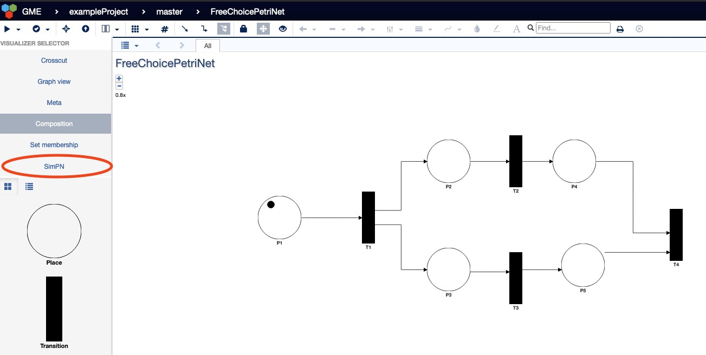
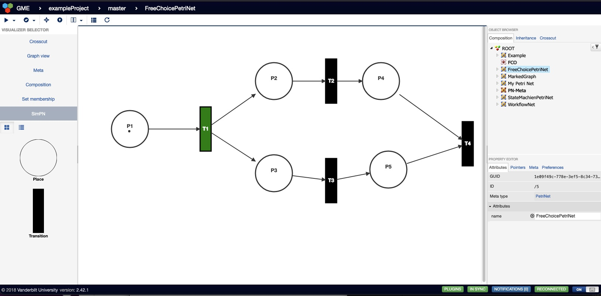
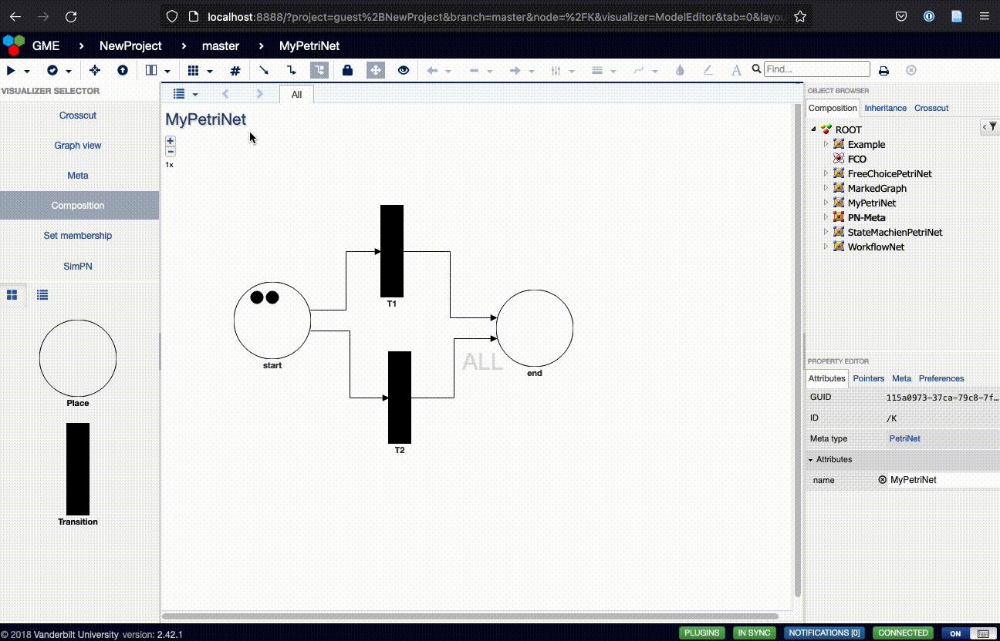
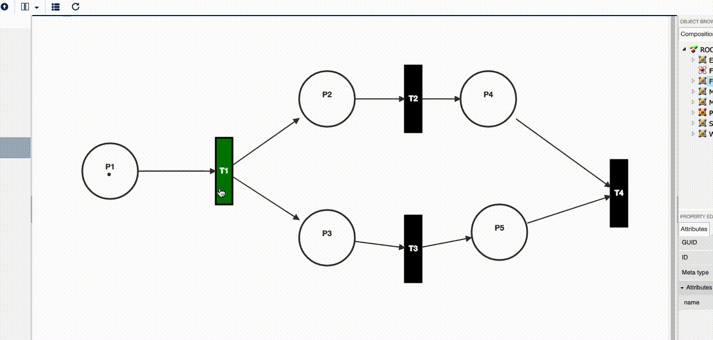

# Petri Net Design Studio
This repository is intended to serve as a bootstrap for a fully docker based Petri Net Design Studio development with WebGME.

A Petri Net is a mathematical modeling language for describing distributed systems. It is made up of places and transitions, with arcs
connecting the places and transitions. 

A Petri Net is defined as a tuple (P, T, F) where:
- P is a finite set of places
- T is a finite set of transitions (P \u22C2 T = \u2205)
- F \u2286 (P x T) \u22C4 (T x P) is a set of arcs (flow relation)
Additionally, marking M \u2208 P -> Z* is a function that assigns a non-negative integer to every place and represents the state of the net.

Places that have arcs leading into transitions are called inplaces for the transition. While places that are the desitnation for arcs originating at a transition are called outplaces.

The markings are represented by tokens which are assigned to a place. If all of the inplaces of a transition have at least 1 token, then the transition is
considered to be "enabled." An enabled transition can take a single token from each inplace and give a single token to each outplace. It is important to note that
the number of inplaces and outplaces do not need to match. Therefore, if there is only a single inplace and two outplaces for an enabled transition, the transition will consume the single token from the inplace and give each outplace a token.

For more information, please see [wikipidea] (https://en.wikipedia.org/wiki/Petri_net).

## Use cases for Petri Nets
Petri Nets lends itself to the modeling of logical systems including state machines, formal languages, parallelism, data flow, communication protocols, 
and synchronization control. A fantastic presentation on Petri Nets, along with their applications can be [here](https://people.cs.pitt.edu/~chang/231/y16/231sem/semObrien.pdf). A number of example Petri Nets are included in the Petri Net Design Studion and at the end of the README you will find additional details on each example.

## How to install the design studio
The easiest way to start using this project is to fork it in git. Alternatively, you can create your empty repository, copy the content and just rename all instances of 'WDeStuP' to your liking. Assuming you fork, you can start-up following these few simple steps:
- install [Docker-Desktop](https://www.docker.com/products/docker-desktop)
- clone the repository
- edit the '.env' file so that the BASE_DIR variable points to the main repository directory
- `docker-compose up -d`
- connect to your server at http://localhost:8888

### Some additional docker commands
All of the following commands should be used from your main project directory (where this file also should be):
- To **rebuild** the complete solution `docker-compose build` (and follow with the `docker-compose up -d` to restart the server)
- To **debug** using the logs of the WebGME service `docker-compose logs webgme`
- To **stop** the server just use `docker-compose stop`
- To **enter** the WebGME container and use WebGME commands `docker-compose exec webgme /usr/bin` (you can exit by simply closing the command line with linux command 'exit') 
- To **clean** the host machine of unused (old version) images `docker system prune -f`

## How to start modeling a Petri Net
After going to http://localhost:8888, you will need to create a new project. In the pop up window, choose the "Create new..." button:

Next, type in the name of the project and click the Create button:

After clicking Create, you are shown a dropdown to choose an existing seed. Select petriNet from the options:

You will now be presented with the ROOT object in the Composition visualizer:

To start a new Petri Net, simple drag the PetriNet from the left side and drop it onto the ROOT window:

At this point, you can click on the PetriNet and change the name attribute:

Now, you can double click on the "My Petri Net" to change the Composition visualizer to of that object:

At this point, you can drag the Place objects and Transition objects onto the panel and you can change their name attributes:

You can connect Place and Transition objects with Arcs by clicking on a Place and dragging to a Transition or by clicking
on a Transition and dragging to a Place:

Finally, to add tokens to a Place, click on the Place and adjust the capacity attribute. Please note that you may have to hit Enter in the attribute field to save the changes.

## How to use the visualizer to simulate and classify a Petri Net
Once you have a Petri Net, you can test the simulator by selecting SimPN from the Visualizer Selector:

After choosing SimPN, the Petri Net will now be represented in the simulator:

### Classify the Petri Net
The SimPN visualizer, can check the Petri Net to see if it can be appropriately be classified as:
- Free Choice
- State Machine
- Marked Graph
- Workflow Net
For details on the different classifications, please see the end of the README.

In the simulator, you can select the "Check Classifications" button from the toolbar to receive a notification listing the valid classifications:

### Simulating the Petri Net
To simulate the Petri Net, "enabled" transitions appear in green. By double clicking the enabled transition, a marker from each inplace is removed and a marker is passed to each outplace.

If the Petri Net gets to a state where there are no longer any enabled transitions, a deadlock alert is presented. 

Clicking the Reset button will then reset the Petri Net and allow for the simulation to begin again.

## Included in the Petri Net Design Studio are a number of examples of Petri Nets.
### Free Choice Petri Net
A Free Choice Petri Net requires that each transition have its own unique set of inplaces. There should not be any two transitions that share an inplace.

### State Machine Petri Net
A Petri Net is classified as State Machine if every transition has exactly one inplace and one outplate. This does allow for a place to have multiple arcs going to different transitions, but again each transition must have only a single inplace and outplace.

### Marked Graph Petri Net
A Petri Net is classified as a Marked Graph if every place has exactly one out transition and one in transition. This does allow for a transition to have multiple inplaces or outplaces, but the places can only have one arc coming from a transition and one arc going to a transition.

### Workflow Net Petri Net
A Petri Net is classified as a Workflow Net if there is a single start place, a single end place, and every place and transition is on the path from the start to the end places. This means that only one place will not have an arc coming from a transition, this is the start place. Only one place will not have an arc go to a transition, this is the end place. Also, every transition will have at least one inplace and at least one outplace otherwise, it would not be part of the path from the start place to end place.